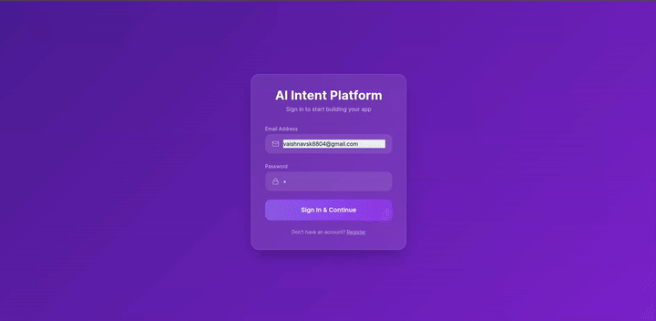

# 🚀 AI Native App Development Platform

An AI-powered platform that converts natural language ideas into complete full-stack application blueprints - including architecture, APIs, database schema, and UI flows.

---
## 🎥 Product Walkthrough

See how AI Intent transforms ideas into applications:

<p align="center">
  
</p>

---

## 🌟 Features

* 🔐 User Authentication (JWT-based)
* 🧠 AI-powered app generation (via Groq LLM)
* 🏗️ Architecture design (Frontend, Backend, Services)
* 🗄️ Database schema generation
* 🔌 API structure generation
* 🎯 UI/UX flow suggestions
* 📊 Validation & risk analysis
* ☁️ Supabase PostgreSQL integration

---

## 🏗️ Project Structure

```
ai-native-app-development/
│
├── backend/                # FastAPI backend
├── frontend/
│   └── ai-intent-frontend/ # React frontend (Vite)
├── README.md
```

---

## ⚙️ Tech Stack

### Backend

* FastAPI
* SQLAlchemy
* PostgreSQL (Supabase)
* JWT Authentication
* Groq LLM API

### Frontend

* React (Vite)
* Axios
* Tailwind CSS

---

## 🚀 Getting Started

### 1️⃣ Clone Repo

```
git clone https://github.com/Vaishnav88sk/ai-native-app-development.git
cd ai-native-app-development/
```

---

## 🔧 Backend Setup

```
cd backend/
python3 -m venv venv
source venv/bin/activate
pip install -r requirements.txt
```

Create `.env`:

```
DATABASE_URL=your_supabase_url
SECRET_KEY=your_secret
GROQ_API_KEY=your_key
ALLOWED_ORIGINS=http://localhost:5173,http://127.0.0.1:5173,https://your-frontend-domain.com
```

Run:

```
uvicorn main:app --reload
```

---

## 🎨 Frontend Setup

```
cd frontend/ai-intent-frontend
npm install
```

Create `.env`:

```
VITE_API_BASE=http://127.0.0.1:8000 or https://your-backend-domain.com
```

Run:

```
npm run dev
```

---

## 🔐 Environment Variables

### Backend

* `DATABASE_URL`
* `SECRET_KEY`
* `GROQ_API_KEY`
* `ALLOWED_ORIGINS`

### Frontend

* `VITE_API_BASE`

---

## 🌍 Deployment Notes

* Update CORS origins in backend
* Use production DB (Supabase)
* Set environment variables in hosting platform

---

## ✨ Example Prompts


### 📝 Productivity App
Build a todo app with user authentication, task categories, due dates, and progress tracking dashboard

### 🛒 E-Commerce Platform
Create an e-commerce web app with product listings, shopping cart, user accounts, and secure checkout system

### 🤖 AI Assistant
Build an AI chatbot for customer support with conversation history, FAQs, and real-time responses

### 📊 SaaS Dashboard
Create a project management tool with Kanban boards, team collaboration, task assignments, and analytics dashboard

---

## 📌 Future Improvements

* 🔄 Code generation download
* 🧩 Plugin architecture
* 📈 Analytics dashboard
* 🔐 Supabase Auth integration

---


